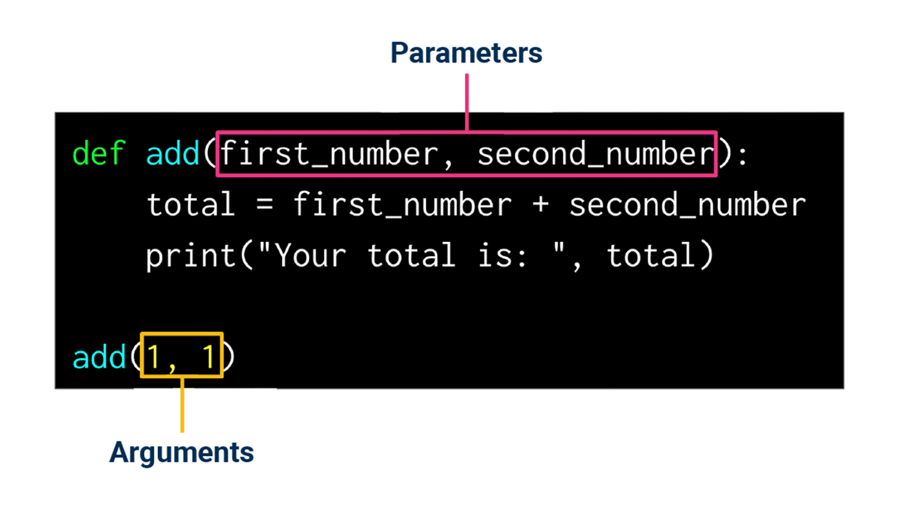
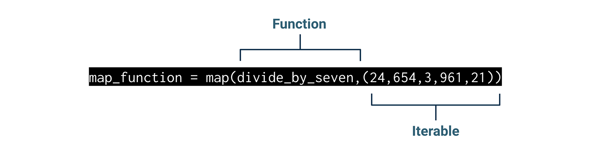
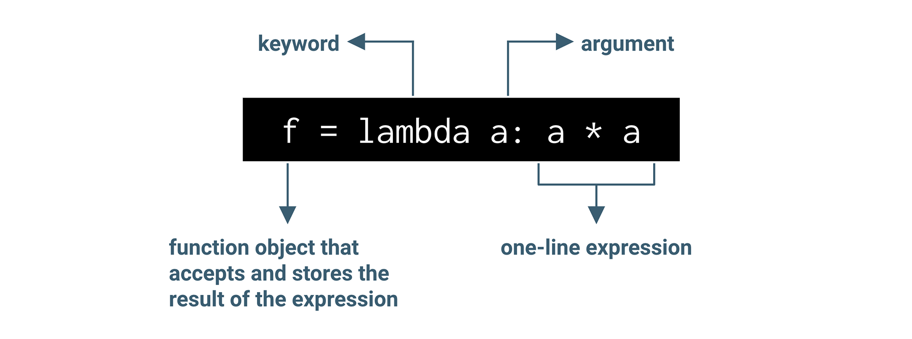
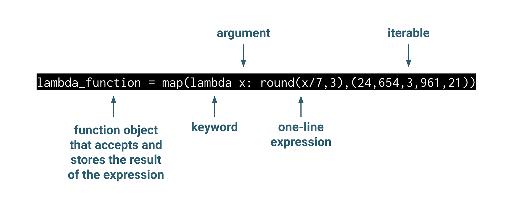

## Module 3.1:  Programming with Functions Part 1

### Overview

In this lesson, the students will learn the importance of using functions in programming and the different features of Python functions, write and execute Python functions, perform transformations on iterable objects using Python built-in functions, and learn how to document their code using the latest Python standards.

### Class Objectives

By the end of today's class, the students will be able to:

* Understand the importance of functions.
* Create, write, and use Python functions.
* Perform transformations on iterable objects using Python built-in functions.
* Document and style your code using the latest standards.

---

### Instructor Notes

This week the students will continue programming in Python. Today’s lesson will focus on creating and writing functions in Python, using some of the built-in Python functions like map, lambda, and filter. Then, they’ll learn how to use Python standards for documenting and styling their code.

Some students may struggle with the pace of class or the Python concepts we’re covering. Ensure that TAs are circulating and aiding students who need support. If class is ahead of schedule, students may have extra time for additional problems or reviews of class material.

---

### Class Slides

The slides for this lesson can be viewed on Google Drive here: [Module 3.1 Slides](https://docs.google.com/presentation/d/1Lgn-_ZWoK1Zu3zcgUekVTCaTXRPFFB18pfeSYUkwrDo/edit?usp=sharing).

To add the slides to the student-facing repository, download the slides as a PDF by navigating to File, selecting "Download as," and then choosing "PDF document." Then, add the PDF file to your class repository along with other necessary files. You can view instructions for this [here](https://docs.google.com/document/d/1XM90c4s9XjwZHjdUlwEMcv2iXcO_yRGx5p2iLZ3BGNI/edit).

**Note** Editing access is not available for this document. If you wish to modify the slides, create a copy by navigating to File and selecting "Make a copy...".

---

### Time Tracker

| Start Time | Number | Activity                                           | Duration |
| ---------- | ------ | -------------------------------------------------- | -------- |
| 6:30 PM    | 1      | Instructor Do: Introduction to the Class           | 0:05     |
| 6:35 PM    | 2      | Instructor Do: Why Use Functions?                  | 0:10     |
| 6:45 PM    | 3      | Instructor Do: Getting Started with Functions      | 0:10     |
| 6:55 PM    | 4      | Students Do: A Definitive Buy                      | 0:10     |
| 7:05 PM    | 5      | Review: A Definitive Buy                           | 0:05     |
| 7:10 PM    | 6      | Instructor Do: Function Variables and Parameters   | 0:15     |
| 7:25 PM    | 7      | Students Do: Car Loan Calculator                   | 0:10     |
| 7:35 PM    | 8      | Review: Car Loan Calculator                        | 0:10     |
| 7:45 PM    | 9      | Instructor Do: Returning Values                    | 0:10     |
| 7:55 PM    | 10     | Students Do: Returned Goods                        | 0:10     |
| 8:05 PM    | 11     | Review: Returned Goods                             | 0:05     |
| 8:10 PM    | 12     | BREAK                                              | 0:15     |
| 8:25 PM    | 13     | Instructor Do: Anonymous and Built-in Functions    | 0:15     |
| 8:40 PM    | 14     | Students Do: Map, Lambda, and Filter Functions     | 0:10     |
| 8:50 PM    | 15     | Review: Map, Lambda, and Filter Functions          | 0:05     |
| 8:55 PM    | 16     | Instructor Do: Documenting Your Code               | 0:15     |
| 9:10 PM    | 17     | Students Do: Pizza Order Documentation             | 0:10     |
| 9:20 PM    | 18     | Review: Pizza Order Documentation                  | 0:05     |
| 9:25 PM    | 19     | End Class                                          | 0:05     |
| 9:30 PM    |        | END                                                |          |


---

### 1. Instructor Do: Introduction to the Class (5 min)

Open the slideshow and welcome the class.

Cover the following points:

* Welcome the students and explain that in today’s lesson they will be introduced to Python functions.

* By the end of the lesson students will be able to:
    * Understand the importance of Python functions.
    * Create, write, and use Python functions.
    * Perform transformations on iterable objects using Python built-in functions.
    * Document and style code using the latest standards.

---

### 2. Instructor Do: Why Use Functions? (10 min)

Continue using the slideshow to accompany this demonstration.

Explain to students that:

* Experienced programmers love the mantra, "Don't repeat yourself." They repeat it so much that it's become an acronym: **DRY**

* In programming, it's best practice to avoid repeating code as much as possible. So when we say that good programmers are DRY, we mean that they look for ways to simplify and reuse common code without explicitly repeating it. That's where functions come in.

* In this lesson, you'll learn how to create functions in Python that can make your code cleaner and easier to read and use.

#### What Is a Function?

Next, introduce functions and their usefulness to students:

* A function is a block of reusable code that can be used to perform an action. Functions are also able to take optional inputs and return outputs.

#### Why Use Functions?

The fact that functions are reusable makes them uniquely useful in three ways:

* **Organization:**
    * Functions make code more readable because blocks of code are condensed (or _wrapped_) into a single, callable name.

* **Modularity:**
    * Functions can be called multiple times and used over and over again.

* **Comprehension:**
    * In long, complex tasks, code can be split up into smaller blocks, resulting in a more readable code.

Point out that the convention is to define functions with descriptive names, which is a good indicator of what the function will be trying to achieve while still hiding the details of how it is implemented from the programmer.  All of this makes your code easier to understand for you and for any collaborators who work with you.

---

### 3. Instructor Do: Getting Started with Functions (10 min)

**Corresponding Activity:** [01-Ins_Functions](Activities/01-Ins_Functions/)

Continue using the slideshow to accompany this demonstration:

Prompt the students with the following:

* Have you ever used `sum()` in a spreadsheet tool to total a list of numbers?
* Think back to when we used `max()` on a list of numbers?

These are examples of functions.

By using the `max()` function, you have instructed Python to compare your inputs to each other and you expect it to return the item with the highest value from your input. You are able to accomplish that simply by typing (or **calling**) the function's name.

Prompt the students to think back to the list functions they were introduced in the previous module:

* Recall that you were introduced to list functions  `len()`, `max()`, `min()`, `sum()`, `append()`, `pop()`, `remove()`

* For each of the following functions, think about:
    * Does the name of the function align with the task the function does?
    * What do you expect the function to do (or **return**)?

Next, introduce students to a simple function definition, but before showing students the code snippet of the `hello` function, ask them the following question:

* If I were to tell you there is a function called "hello" what would you expect it to do?

  * **Hint:** If a student is stuck, let them know that the function output is text-based.

* The following code shows an example of the Python function `hello`:

    ```python
    # Define the hello function.
    def hello():
        print("Hello!")
    hello()
    ```

* Point out that there is a print statement, so, as discussed before, our expectation that the function would output some kind of greeting was correct.

Draw students' attention to the `def` keyword:

* The first line tells Python that we're dealing with a function and, more specifically, we are creating a new function. To do so, we use `def` which stands for "define," and indicates that we're defining a function.

#### Defining Functions

Begin by outlining the function definition process as follows:

Defining a function is a straightforward process. There are two parts to defining a function: the definition and the body.

**Function definition**

 * Mention that the `def` keyword is needed to trigger the function definition. Just like `if` and `else` for conditional tests, `def` is a special keyword in Python reserved for defining a function.

The function name follows directly after the `def` keyword. When you define your own functions, keep in mind that, similar to variables, function names are descriptive and indicate the task being executed by the function. The name of the function should be followed by a set of parentheses and a colon.

**Function Body**

After defining the function, you can then put any code that you want in the **function body**.

**Important** The code in the function body must be indented. Otherwise, the code may not be executed and lead to programmatic errors, or it will run as part of the Python file. The following example shows what this looks like:

```python
# Define the scream function.
def scream():
    print("AAAAH!")
scream()
scream()
scream()
print("Okay, I feel much better.")
```
The result of executing the function appears below:

```text
AAAAH!
AAAAH!
AAAAH!
Okay, I feel much better.
```

* Point out that the indented print statement prints for "AAAAH!".  When we run the function, this print statement is executed three times–more on this later. Then, the un-indented print statement, "Okay, I feel much better.", is printed.

* If we were to comment out the `print("AAAAH!")` then the only output would be, "Okay, I feel much better.".

#### Calling Functions

In the previous examples, we were actually both defining the function and calling it. Ask the students to guess where the function call is in the following example?

```python
def scream():
        print("AAAAH!")
scream()
```

Before moving on, go over the following to reinforce the function definition, body, and function call:

* The function definition is: `def scream():`

* The function body is: `print("AAAAH!")`

* The function call is: `scream()`

* Mention to the students that they can think of the function definition and body a blueprint of a house. They tell Python that there's a block of code with a function name, but it doesn't run the code until you need it.

* The function call is where the magic happens. This is what tells Python to actually run, or execute, the code inside the function. We refer to this as **calling** the function.

    * **Important** Without a function call, a function will not be executed.

As we saw earlier, you can call a function as many times as you want! Count the calls in the following example:

```python
scream()
scream()
scream()
```

#### Executing Code

Draw the students’ attention to the following by using the preceding code:

* In Python programming, it is common to use the conditional statement, or idiom, `if __name__ == "__main__":` to house the code that you actually want to execute.

* Mention that when adding the `if __name__ == "__main__":` to the function there are two rules:
    * It is placed at the end and is never indented.
    * All the code under the conditional statement is indented.

* Underneath the conditional statement, the function call is indented.

    ```python
    #Define the scream function
    def scream():
        print("AAAAH!")

    # Name-main idiom with the function call.
    if __name__ == "__main__":
        scream()
        scream()
        scream()
        print("Okay, I feel much better.")
    ```

* The output is:

    ```text
    AAAAH!
    AAAAH!
    AAAAH!
    Okay, I feel much better.
    ```

* Mention to students that the output is the same as earlier, so this may seem like it is an unnecessary step but it’s important to adhere to coding best practices because they exist to help programmers avoid errors in their code.

Briefly mention how this conditional statement works:

 *  The conditional statement behaves just like any `if` statement. If the expression is `True` then the code is executed.
 * When is it `True`? The `__name__` variable is a built-in Python variable that holds the name of the current Python script. When this Python script is executed directly, the `__name__` variable is set to `"__main__"`.

* **Note** When importing functions in Python files, the `if __name__ == "__main__":` can be removed from the function because the code inside the if statement is not executed when the file's code is imported as a module.

### 4. Students Do: A Definitive Buy (10 min)

**Corresponding Activity:** [02-Stu_Definitive_Buy](Activities/02-Stu_Definitive_Buy/)

Now, students will do some work creating their own function that will be used in the back end of a new payment processing system. The aim of the task is to write a single, reusable function that will be called each time a payment occurs in the system.

Open up the solution file within the terminal or VS Code, and run through the application to give students an idea of how it works.

Then, send out the starter code and the instructions in the README file.

Answer any questions that students have about the activity.

---

### 5. Review: A Definitive Buy (5 min)

**Corresponding Activity:** [02-Stu_Definitive_Buy](Activities/02-Stu_Definitive_Buy/)

Send out the solution file and go over the code with the class, answering any questions from students.

Cover the following key points during your discussion:

* First, we define the function `process_payment`.

* Then, we create two print statements in the function body. The first one prints "The total cost of this transaction will be 75 cents." The second one prints, "Ka-ching! Payment has been processed."

* Finally, we call the function after the `if __name__ == "__main__":` statement.

    ```python
    def process_payment():
        print("The total cost of this transaction will be 75 cents.")
        print("Ka-ching! Payment has been processed.")

    if __name__ == "__main__":
        process_payment()
    ```

Answer any questions before moving on.

---

### 6. Instructor Do: Function Variables and Parameters (15 min)


**Corresponding Activity:** [03-Ins_Variables_Arguments](Activities/03-Ins_Variables_Arguments/)

Continue using the slideshow to accompany this demonstration.

In this activity, you’ll demonstrate to the students the difference between local and global variables when using functions and passing arguments in functions.

#### Scope

Outline scope and its importance using the following talking points:

* Point out to the students that, up to this point, they have defined functions and declared variables, and have a good understanding of the importance of choosing a good name for functions and variables when you define them. But where you choose to define/declare them in a function is equally important.

* Python makes use of the concept of **scope** to prevent unintended mistakes caused by naming collisions. **Scope** refers to the part of the program that has "knowledge" of a variable.

    * For example, if you define the `total` variable as follows, `total = 12`, inside a function and then try to call `total` outside of that function, you will get an error message. The `total` variable “scope” is only inside of the function.

* The two most common types of scope are **local** and **global.**

#### Local and Global Variables.

Begin by showing the following function that adds two numbers, as follows:

```python
# Define a function that will add two numbers.
def add():
    first_number = 1 # This is a local scope of the function.
    second_number = 2 # This is a local scope of the function.
    total = first_number + second_number
    print("Your total is: ", total)

add()
```

* Point out that the variables ` first_number` and `second_number` are only accessible to the `add()` function, which means that they are **local variables** or **local scopes**. Only statements inside the function can access the local variables.

* Mention that if we were to try to print the variables defined inside the function in a print statement “outside” of the function as the example shows, then you will get the following error:  `NameError: name 'first_number' is not defined`.

    ```python
    def add():
        """This function takes two numbers and adds them and then returns the total."""
        first_number = 1 # This is a local scope of the function.
        second_number = 2 # This is a local scope of the function.
        total = first_number + second_number
        print(f"Your total is: {total}")


    if __name__ == "__main__":
        add()
        print(first_number)
    ```

* The output from running the code above is:

    ```text
    Your total is: 3
    Traceback (most recent call last):
    line 14, in <module>
        print(first_number)
    NameError: name 'first_number' is not defined
    ```

* Emphasize that we get this error because variables defined within functions are only accessible inside the function. That is why these are **local** variables. Variables outside of a function are **global** variables.

* Next, show how we can define global variables by creating the variables `first_number` and `second_number` before the function is defined as follows:

    ```python
    # Global variables for first_number and second_number.
    first_number = 2
    second_number = 3

    # Define a function that will add two numbers.
    def add():
        first_number = 4 # This is a local variable of the function.
        second_number = 6 # This is a local variable of the function.
        total = first_number + second_number
        print("Your total is: ", total)

    if __name__ == "__main__":
        add()
        print(f"The global variables for the 'first_number' and 'second_number` are {first_number} and {second_number}")
    ```

* Ask students what they think the output for this code will be. Their remarks should reflect that they understand:
  * That the function sums the locally defined variable **and** prints the sum it calculated.
  * That the global variables remain unchanged, even though the local variables declared inside the `add` function have the same names.

* Then, run the code and point out that executing this code will not affect the local variables in the `add()` function as the following output shows:

    ```text
    Your total is: 10
    The global variables for the 'first_number' and 'second_number` are 2 and 3.
    ```

Answer any questions before moving on.

#### Python Parameters and Arguments

Point out that functions take parameters in the form of arguments.

 * **Parameters** are variables used in a function that refer to the data. The function uses the data to perform its actions. The function gets the data in the form of **arguments**.

* Arguments can be numbers, strings, predefined variables, lists, dictionaries, and tuples.


    

Mention that there we are going to cover the five common ways of passing arguments to parameters using functions:

* Positional
* Keyword
* Combination of positional and keyword
* Iterable unpacking
* Dictionary unpacking

Next, go over each example briefly with text and code.

##### Positional Arguments

Using positional arguments is the most common method of passing arguments to functions. When using positional arguments, the position of the argument in the function call is assigned to the parameter with the corresponding “position” in the function definition. For example:

```python
# 1. Positional arguments.
def positional(x, y):
    """This function adds two positional arguments,
    adds them, and prints the total"""
    total = x + y
    print(f"The total is: {total}")

if __name__ == "__main__":
    positional(5,12)
```

* Point out that the number 5 is assigned to the `x` variable and the number 12 is assigned to the `y` variable. However, we can pass 12 to the `x` variable and 5 to the `y` variable and get the same output.

Go over the next example to emphasize positional arguments that result in an incorrect “balance” then, uncomment the second function call to produce the correct output.

```python
# 1b. Positional arguments.
def savings(balance, apr, days):
    """This function adds three positional arguments,
    adds them and prints the total"""
    interest_rate = (apr/100) * (days/365)
    interest_earned = balance * interest_rate
    balance += interest_earned
    print(f"The new balance is: {balance}")

if __name__ == "__main__":
    # Incorrect positional order.
    savings(5, 31, 50000)
    # Correct positional order
    # savings(50000, 3, 31) # uncomment this line and run again.
```

##### Keyword Arguments

Emphasize that, when using keyword arguments in a function call, the keywords are assigned to parameters using the `name=value` syntax as follows:

```python
# 2. Keyword arguments.
def keyword(a, b, c):
    """This function takes three keyword arguments,
    adds them, and prints the total"""
    total = a + b + c
    print(f"The total is: {total}")

if __name__ == "__main__":
    keyword(a=-3, c=10, b=5)
```

* Point out that, when the `keyword` function was called, the variable names allow for clarity since you can be sure you know what your variables are called within the function.

* Mention that, unlike in positional arguments, the order of the arguments doesn’t matter, which makes the code more readable and easier to debug.

##### Combination of Keyword and Positional Arguments

Let the students know that they can use a combination of positional and keyword arguments at the same time, but they must keep in mind that positional arguments have to be listed before the keyword arguments. Consider the following example:

```python
# 3. Keyword and positional arguments
def pos_key_args(a, b, c):
    """This function takes one positional argument
    and two keyword arguments, adds them, and prints the total"""
    total = a + b + c
    print(f"The total is: {total}")

if __name__ == "__main__":
    pos_key_args(42, b=-10, c=5)
    # pos_key_args(b=-10, c=5, 42) # uncomment this line and run again.
```

##### Iterable Unpacking

Emphasize that we can pass iterables as parameters. When we “unpack” an iterable, we use the `*iterable_name` syntax to pass the elements of an iterable as positional arguments to a function just like using positional arguments as follows:

```python
# 4. Iterable unpacking arguments
def iterable(a, b, c):
    """This function takes an iterable (list or tuple),
    adds the values in the iterable, and prints the total"""
    total = a + b + c
    print(f"The total is: {total}")

if __name__ == "__main__":
    tuple_values = (5, -10, 7)
    list_values = [7, 23, -11]
    iterable(*tuple_values)
    iterable(*list_values)
```

* Point out that the `*` that precedes the iterable name allows us to pass each element in the iterable as an individual argument `a`, `b`, and `c` inside the function, and summed together without the need to use a `for` loop.


##### Dictionary Unpacking

Lastly, begin by mentioning that we can unpack a Python dictionary in a similar manner to an iterable.

* If we want to pass the values of each key to the function, we use the `**dictionary_name` syntax.

* **Important** If you use one one asterisk instead of two, then the dictionary keys are passed as the arguments.

    ```python
    # 5. Dictionary unpacking arguments.
    def dictionary(a, b, c):
        """This function takes an iterable (list of tuple)
        and adds the values in the iterable, and prints the total"""
        total = a + b + c
        print(f"The total is: {total}")

    if __name__ == "__main__":
        dict_values = {'b': -4, 'c': 100, 'a':-42 }
        dictionary(*dict_values) # returns the keys
        dictionary(**dict_values) # returns the values
    ```

Answer any questions before moving on.

---

### 7. Students Do: Car Loan Calculator (10 min)

**Corresponding Activity:** [04-Stu_Car_Loan_Calculator](Activities/04-Stu_Car_Loan_Calculator/)

Remind students that they’ll need to open the file in VS Code to work with the code, but then navigate to the file in either Terminal or GitBash to run it.

After answering any questions that students have about the activity, send out the instructions.

Open the slideshow, and use the next slides as an accompaniment to the activity.

---

### 8. Review: Car Loan Calculator (10 min)

**Corresponding Activity:** [04-Stu_Car_Loan_Calculator](Activities/04-Stu_Car_Loan_Calculator/)

Send out the solution file and go over the code with the class, answering any questions students may have about the activity.

Cover the following key points during your discussion:

* First, we add the parameters `current_loan_value`, `annual_interest_rate`, and `months_remaining` to the `calculate_future_value` function.

    ```python
    def calculate_future_value(current_loan_value, annual_interest_rate, months_remaining):
    ```

* Then, we add the `future_value` formula that is provided to the body of the function, and create a print statement that prints the future value of the car loan to 2 decimal places and thousandths.

    ```python
    def calculate_future_value(current_loan_value, annual_interest_rate, months_remaining):
        """
        Create a function called calculate_future_value
        Args:
            current_loan_value (float): The current loan value
            the annual_interest_rate (float): The APR
            the months_remaining (int): The number of months remaining on the loan

        Returns:
            Prints the future value of the loan as a float.
        """
        future_value = current_loan_value * (1 + (annual_interest_rate / 12)) ** months_remaining
        # Print the future value of the car to 2 decimal places and thousandths.
        print(f"The future value of the new car is ${future_value: ,.2f}.")

    if __name__ == "__main__":
    ```

* Finally, we call the function and pass in the values of the `new_car_loan` dictionary as the arguments, making sure to match the arguments positions to the function parameters.

    ```python
    if __name__ == "__main__":
        # The new_car_loan dictionary.
        new_car_loan = {
            "current_loan_value": 25000,
            "months_remaining": 6,
            "annual_interest_rate": 0.085
            }

        # Set the function call equal to a variable called cost_of_new_car.
        # Pass the relevant information from the dictionary as parameters to the function.
        calculate_future_value(
            new_car_loan["current_loan_value"],
            new_car_loan["annual_interest_rate"],
            new_car_loan["months_remaining"]
            )
    ```

Answer any questions before moving on.

---

### 9. Instructor Do: Returning Values (10 min)

**Corresponding Activity:** [05-Ins_Returning_Values](Activities/05-Ins_Returning_Values/)

Continue using the slideshow to accompany this demonstration.

In this activity, you’ll demonstrate how functions return values.

Begin by recapping what has been covered about functions so far:

* What functions are and why they are important
* How to define functions
* Function variables and parameters
* The last thing about functions that we will cover today is the function `return` statement to send the function's result back to the caller.

Consider the following function.

```python
def average_numbers(numbers):
    """ Calculates the average of an array of numbers"""
    average = sum(numbers) / len(numbers)
    print("The average is: ", average)

if __name__ == "__main__":
    average_numbers([1, 2, 3])
```

This function takes in a list of numbers, sums them, and divides by their count (the length, or number of elements, of the list). It then prints the resulting average.

```text
The average is:  2.0
```
* Emphasize that, by creating the `average_numbers` function, we are able to calculate the average of a list repeatedly. But what if we wanted to repeatedly use the result of this specific calculation for the average of the list `[1, 2, 3]`?

* While it’s true that we’ve declared the variable `average`, which will store the value, it is only locally available to the function because it’s defined inside the function body. If we were to call the variable `average` in the name-main clause, we would get an error.

* Remind the students that one important point in using functions is modularity, or reuse. To allow us to reuse the `average_numbers` function for any list of variables and get the average we can add the `return` statement in the body of the function as follows:

    ```python
    def average_numbers(numbers):
        """ Calculates the average of an array of numbers"""
        average = sum(numbers) / len(numbers)
        return average

    if __name__ == "__main__":
        first_average = average_numbers([1, 2, 3])
        second_average = average_numbers([4, 5, 6])
        print(f'The average of the first list is {first_average}')
        print(f'The average of the second list is {second_average}')
    ```

Point out that in the code, the line: `first_average = average_numbers([1, 2, 3])`, the list of numbers are passed to the function and the average is calculated. Then, the function “returns” the average to the variable `first_average`.  The same results happen with the next variable `second_average = average_numbers([4, 5, 6])`.

```text
The average of the first list is 2.0
The average of the second list is 5.0
```
Let students know that, in the activity to follow, they will be threading together their knowledge of function definitions, parameters, and returns.

---

### 10. Students Do: Returned Goods (10 min)

**Corresponding Activity:** [06-Stu_Returned_Goods](Activities/06-Stu_Returned_Goods/)

Students will now complete an activity where they will create a function that automatically determines insurance payouts each week.

After answering any questions that students have about the activity, send out the instructions.

Open the slideshow, and use the next slides as an accompaniment to the activity.

---

### 11. Review: Returned Goods (5 min)

**Corresponding Activity:** [06-Stu_Returned_Goods](Activities/06-Stu_Returned_Goods/)

Send out the solution file and go over the code with the class, answering any questions students may have about the activity.

Cover the following key points during your discussion:

* In the `process_claims` function we pass in the parameter `claims`.

* In the function body we add up all the claim values in the `claims` list using the `sum()` function, then we calculate the payout by multiplying the total claims by 0.30, and return the total payout back to the function as follows:

    ```python
    # Define a new function called process_claims
    def process_claims(claims):
        """
        Calculate the total insurance payout based on a list of claims.
        Args:
            claims (list): A list of claim amounts.
        Returns:
            float: The total insurance payout, which is 30% of the sum of all claims.
        """
        # Create a variable called `total_claims`, that is the sum of all claims
        total_claims = sum(claims)
        # Calculate a total payout, which is 30% of total_claims:
        total_payout = total_claims * 0.30
        # Return only the total_payout amount
        return total_payout

    if __name__ == "__main__":
    ```

* The `total_insurance_payout` variable is used to define the function. In the function call we pass the `weekly_claims` list that is provided, and then we create a print statement that prints out the `total_insurance_payout` to two decimal places and thousandths.

    ```python
    if __name__ == "__main__":
        # Add the weekly claims
        weekly_claims = [5000, 1000, 8000, 10000, 3000, 3500]
        # Create a variable that passes the weekly claims to the function.
        total_insurance_payout = process_claims(weekly_claims)
        # Print the total insurance payout to 2 decimal places and thousandths.
        print(f"The total insurance payout is: ${total_insurance_payout: ,.2f}.")
    ```

Answer any questions before moving on.

---

### 12. BREAK (15 min)

---

### 13. Instructor Do: Anonymous and Built-in Functions (15 min)

**Corresponding Activity:** [07-Ins_Anonymous_Built-in_Functions](Activities/07-Ins_Anonymous_Built-in_Functions/)

Continue using the slideshow to accompany this demonstration.

Begin by mentioning that, up to this point in the course, the students have used many Python functions to perform some basic tasks. However, there are a few built-in Python functions that are power-packed to make programming much easier.

In this activity, you’ll demonstrate how to use some common Python built-in functions, such as **map**, **lambda**, and **filter**.

Point the benefits of using built-in functions:

* Understanding these functions will allow you to work with iterable objects like lists without using cumbersome `for` loops.
* The distinct benefit of packing these iterations into functions, besides being a short cut, is that it allows us to focus on the more complicated aspects of whatever problem we are attempting to  solve with code.
* The built-in functions serve the same purpose, while elegantly tucking away the details of the implementation, making the iteration less error-prone than a `for` loop that we would manually code ourselves.

#### The `map` Function

* A **`map` function** is another way to simplify our code, whether we’re working with columns and rows in a table, variables in a list, or objects from an iterator object.
* The `map` function is similar to functions that use list comprehension, because its purpose is to apply a function to each iteration in an iterable object. The major difference is that list comprehension can be applied to lists, while the `map` function can be applied more generally to other iterable objects, including dictionaries,

    * When you call the `map` function, you must provide two arguments. Your function call will look like this: `map(fun, iter)`.

    * The `function` object is a function that we want to apply.

    * The `iterable` object is the iterable object that we want to apply the `function`across.

        

To demonstrate how `map` works in a similar way to the list comprehension, we can consider the following example.

* In the following code, we want to take a list of numbers, divide each by 7 and then round the result of the division to the nearest hundredth. This task can be accomplished through both list comprehension and using the `map` function:


   ```python
    # Create a custom function that divides by 7 and rounds to the nearest hundredth
    def divide_by_seven(num):
        """A function that divides by 7 and rounds to the nearest hundredth"""
        return round(num / 7,3)
    print(f"The result of using a Python function: {[divide_by_seven(number) for number in [24,654,3,961,21]]}")

    # Create a list comprehension that divides by 7 and rounds to the nearest hundredth
    list_comprehension = [divide_by_seven(number) for number in [24,654,3,961,21]]

    # Print the results
    print(f"An example of a list comprehension that uses a function: {list_comprehension}")

    # Instead of using a list comprehension we can use the map function to do the same thing.
    map_function = map(divide_by_seven,(24,654,3,961,21))

    # Print the results
    print(f"An example of a map function: {list(map_function)}")
    ```

    ```text
    The result of using a Python function: [3.429, 93.429, 0.429, 137.286, 3.0]
    An example of a list comprehension that uses a function: [3.429, 93.429, 0.429, 137.286, 3.0]
    An example of a map function: [3.429, 93.429, 0.429, 137.286, 3.0]
    ```

In addition to being able to iterate over generic iterable objects, map functions can also apply anonymous functions, like the `lambda` function.

#### The `lambda` function

You will have noticed that there are many ways to write code to accomplish the same thing and the application you choose depends on the problem you are trying to solve and the constraints you have to work within.

* When we worked with functions earlier, we used the `def` keyword followed by a function name to define the function. However, it is possible to define a function without naming it. These functions are known as anonymous functions or **`lambda` functions**.

    * A `lambda` function is not stored as a defined function. Instead, it is executed within the `map` function, and its output is returned just like a typical custom function. Think of it as a one-liner version of a function definition.

    * `lambda` functions are defined using the reserved keyword `lambda`, followed by an argument, a semi-colon, and then the code, or one-line expression that defines the functionality.


        


For example:

```python
   #Lambda function that receives an argument `x` and multiplies it by 3.
   multiply_by_three = lambda x: x*3
```

* **Note** We haven’t called or executed this function.

* In data science, `lambda` functions are commonly nested within `map` functions. This enables us to perform quick transformations in our data without spending time and effort to store values between steps. Here’s an example:

    ```python
    # Demonstrate how to implement the previous example as a lambda function within the map function
    lambda_function = map(lambda x: round(x/7,3),(24,654,3,961,21))
    print(f"An example of a using the lambda function: {list(lambda_function)}")
    ```


    


Point out to students that:

* The lambda in this case receives an argument `x`. The function contains a round function that divides the input by 7 and rounds to three decimal places.
* Notice that the `lambda` function first defines the arguments in front of the colon, `:`. Everything after the colon acts as the return statement from the abstract function. The `map` function applies the `lambda` function in exactly the same way as a predefined function.
* By nesting the lambda function within the `map` function, the `lambda` functionality can be applied iteratively to each item in the list of numbers. We refer to this as the **transformation**.
* The transformed list is then returned to the caller and stored on the `map_function` variable.


#### The `filter` Function

Let students know that the last of the three anonymous functions they will be introduced to today is the `filter` function.

* The `filter` function is defined as follows:

   ```python
   filter(function, iterable)
  ```

* The `filter` function is used to filter out unwanted values from the input iterable.
* This is best demonstrated with an example. Imagine we had a list of numbers and we wanted to have a list that only contains the numbers that are perfectly divisible by 3 and filter out the rest:

    ```python
    # Use the filter and lambda functions to get only the numbers divided by 3.
    numbers = [12, 7, 9, 18, 25, 36, 42, 55, 63]
    divisible_by_3 = list(filter(lambda x: x % 3 == 0, numbers))
    print(divisible_by_3)
    ```

Point out that:

* For `filter` functions, we pass a function into the first argument and allow that to do the selection. In our example, the function that selects the entries divisible 3 is a `lambda` function that uses the remainder operand as you learnt to do in the previous module.
* Next, the iterable is the list of numbers.
* Then, we apply the `filter` function to retrieve the numbers from the numbers list that are divisible by 3, or are `True` for the `lambda x: x % 3 == 0`.
* The list of numbers divisible by 3 will be returned to the caller and stored as a list on the `divisible_by_3` variable.

Answer any questions before moving on.

---

### 14. Students Do: Map, Lambda, and Filter Functions (10 min)

**Corresponding Activity:** [08-Stu_Map_Lambda_Filter_Functions](Activities/08-Stu_Map_Lambda_Filter_Functions/)

In this activity, students will practice using the `map`, `lambda` and `filter` functions.

After answering any questions that students have about the activity, send out the instructions.

Open the slideshow, and use the next slides as an accompaniment to the activity.

---

### 15. Review: Map, Lambda, and Filter Functions (5 min)

**Corresponding Activity:** [08-Stu_Map_Lambda_Filter_Functions](Activities/08-Stu_Map_Lambda_Filter_Functions/)

Send out the solution file and go over the code with the class, answering any questions students may have about the activity.

Cover the following key points during your discussion:

* In the first coding activity, we filter out the even numbers from the following list, `numbers = [1, 2, 3, 4, 5, 6, 7, 8, 9, 10]`, using the filter and lambda functions as follows:

    ```python
    numbers = [1, 2, 3, 4, 5, 6, 7, 8, 9, 10]
    even_numbers = list(filter(lambda x: x % 2 == 0, numbers))
    print(even_numbers)
    ```

* Next, to add the numbers from two lists of numbers we use the map and lambda functions as follows:

    ```python
    numbers1 = [1, 2, 3, 4, 5]
    numbers2 = [10, 20, 30, 40, 50]
    result = list(map(lambda x, y: x + y, numbers1, numbers2))
    print(result)
    ```

* Finally, to split the sentence "My favorite hobby is coding in Python" into words using the map and lambda functions we do the following:

    ```python
    words = list(map(lambda x: x.strip(), sentence.split()))
    print(words)
    ```

Answer any questions before moving on.

---

### 16. Instructor Do: Documenting Your Code (15 min)

**Corresponding Activity:** [09-Ins_Documenting_Code](Activities/09-Ins_Documenting_Code/)

Continue using the slideshow to accompany this demonstration.

In this section, students will learn how to document and style their code according to best practices and why it is important to do so.

#### Why Documentation Matters

Explain the following to the students:

* When you write programs in Python or any other language, you are providing instructions to the computer that describe what you want it to do. We’ve been learning the conventions for how you should define variables, apply functions, provide parameters, and specify what functions should return. Adhering to these conventions helps the computer to understand and execute your instructions.

* It’s easy to assume that if your code executes and behaves as you wish, that your work is done. The collaboration between you and the computer was successful! But to do so would be to forget that there are (at least) two other groups of _humans_ who interact with your code: users and other developers.

* In this section, we will unpack how to help users and other developers understand your work as well as the computer does.

#### Commenting Code

Comments are text used in code addressed to yourself or to other developers and they are mostly used to explain functionality. Any text that is preceded by a `#` when using Python programming language will be treated as a comment by the computer and not included in the executable code.

* **Important** When using VS Code you can create a comment by simultaneously pressing the command + question mark keys on a Mac keyboard and the Alt + question mark key on a PC keyboard.

Some common symbols for commenting code and their programming you might encounter in this course include:

|  Symbol     | Programming Language |
| ----------- | ----------- |
| `# comment`      | Python       |
| `// comment`   | JavaScript        |
| `<!-- comment -->`   | Markdown        |
| `<!-- comment -->`   | HTML        |
| `/* comment */`   | CSS        |

You may have noticed comments in some code that we have worked with in this module and the previous one. Here are a few examples:

```python
# Define the hello function.
def hello():
    print("Hello!")
```

* The comment describes what the purpose of the code block

```python
# Use the filter and lambda functions to get only the numbers divided by 3.
numbers = [12, 7, 9, 18, 25, 36, 42, 55, 63]
divisible_by_3 = list(filter(lambda x: x % 3 == 0, numbers))
print(divisible_by_3)
```

* The comment describes the functionality of the code block or the task it handles.

```python
# Define a function that will add two numbers.
def add():
    first_number = 1 # This is a local scope of the function.
    second_number = 2 # This is a local scope of the function.
    total = first_number + second_number
    print("Your total is: ", total)

add()
```

* This code block contains a comment that defines the functionality of the code block. It also contains *in-line* comments which add more detail about the scope of the variables in context. In-line comments should be avoided except where they add in-context detail that is important to point out, such as above.

Let students know that the convention with comments is to keep them as concise, and use them as sparingly, as possible. Comments for one line should not be longer than 72 characters, if they are, then you should split the comments over multiple lines.

#### Documentation

While commenting is meant to give developers more information about specific lines of code, **documentation** is meant to give users a better understanding of the functions and classes.

When documenting what a function does, we are creating **docstrings**.

Go over the following about docstrings:

* In Python, each object, like functions, has a property called `__doc__` , which stores the docstring and allows the users to bring up a description of the object’s functionality.

* A simple way to create the docstring is to type the description of the object right beneath its definition. The description should be couched on the top and the bottom by three double quotation marks (`"""`).

* Since the objects you are most familiar with right now are functions, let’s take a look at how you could define a docstring for a function:

```python
def my_function(parameter1, parameter2):
    """
    Brief description of the function.

   Optional:
     More detailed description of what the function does.

    Args:
        arg1 (type): Description of arg1.
        arg2 (type): Description of arg2.

    Returns:
        type: Description of the return value or print statement.

    Raises:
        ErrorType: Description of the exception raised, if any.

    Examples:
        Provide some usage examples of the function.

    Note:
        Any additional notes about the function.
    """
    # Function code here

if __name__ == "__main__":
    my_function(arg1=parameter1, arg2=parameter2)
```

Point out the following to the students:

* The docstring outlines all the key information about what powers the functionality of the function, including a short description, a more detailed description, what arguments (parameters) it receives, what data type each parameter is, what the function returns, what errors it raises and why, and some typical uses of the function.

* Point out that the three double quotation marks appear on either end of the description.

Send out the following link to the [PEP-8 standards](https://peps.python.org/pep-0008/#comments) and have the student read through the information under the headings Comments, Block Comments, In-line Comments, and Documentation Strings for reference.

Next, the students will practice documenting code and creating docstrings.

---

### 17. Students Do: Pizza Order Documentation (10 min)

**Corresponding Activity:** [10-Stu_Pizza_Order_Documentation](Activities/10-Stu_Pizza_Order_Documentation/)

In this activity, students will practice adding a docstring that describes one-line or multi-line documentation to explain what the code does.

After answering any questions that students have about the activity, send out the instructions.

Open the slideshow, and use the next slides as an accompaniment to the activity.

---

### 18. Review: Pizza Order Documentation  (5 min)

**Corresponding Activity:** [10-Stu_Pizza_Order_Documentation](Activities/10-Stu_Pizza_Order_Documentation/)

Send out the solution file and go over the code with the class, answering any questions students may have about the activity.

Cover the following key points during your discussion:

* For the `create_pizza_order` function, the docstring may look like this:

```python
def create_pizza_order():
    """
    The function prompts the user to choose three toppings
    from a list of five toppings and creates a pizza order.
    Args:
        None
    Returns:
        None. But it prints out the toppings on the pizza.
    Raises:
        ErrorType: If the user enters a number less than 1 or greater than 5,
        then asks the user to try again.
    """
```

* Ask the students what their one-line comments or multi-line comments are the remaining code. Then, go over some of the key one-line comments from the solution below:

```python
# Iterate through the a range of 3 for the number of toppings
# Prompt the user to input a number for a topping.
for _ in range(3):
    topping_number = int(input("Enter the number of your chosen topping: "))

    # Create a while loop that selects a number between 1 and 5.
    # If a number less than 1 or greater than 5 is selected, prompt the user to try again.
    while topping_number < 1 or topping_number > 5:
        print("Invalid topping number. Please try again.")
        topping_number = int(input("Enter the number of your chosen topping: "))

    # Retrieve the selected topping from the list using toppings[topping_number - 1]
    # Then add the topping to the list.
    selected_toppings.append(toppings[topping_number - 1])
```

Answer any questions before moving on.

---

### 19. End Class (5 min)


Congratulate students on reaching the end of Day 1 for Module 3.

* Functions are an integral part of coding in Python and now you can see why.
* The value of being able to reuse pieces of code to perform specific tasks cannot be emphasized enough.

Mention that students are now able to:
* Understand the importance of functions.
* Create, write, and use Python functions.
* Perform transformations on iterable objects using Python built-in functions.
* Document and style code using the latest standards.

Give the following brief overview of the next lesson:

* In the next lesson, we will focus on ways to make our code more elegant and effective at solving the problems we have at hand. We’ll do this in a few ways:

    * We’ll expand on the idea of a reusable, useful piece of code by delving into modules and modular programming.
    * We’ll look at refactoring code, which is an essential skill for developers to have.
    * We’ll look at how to take business and user needs into consideration when coding a solution to the problem at hand.


---

© 2023 edX Boot Camps LLC. Confidential and Proprietary. All Rights Reserved.
